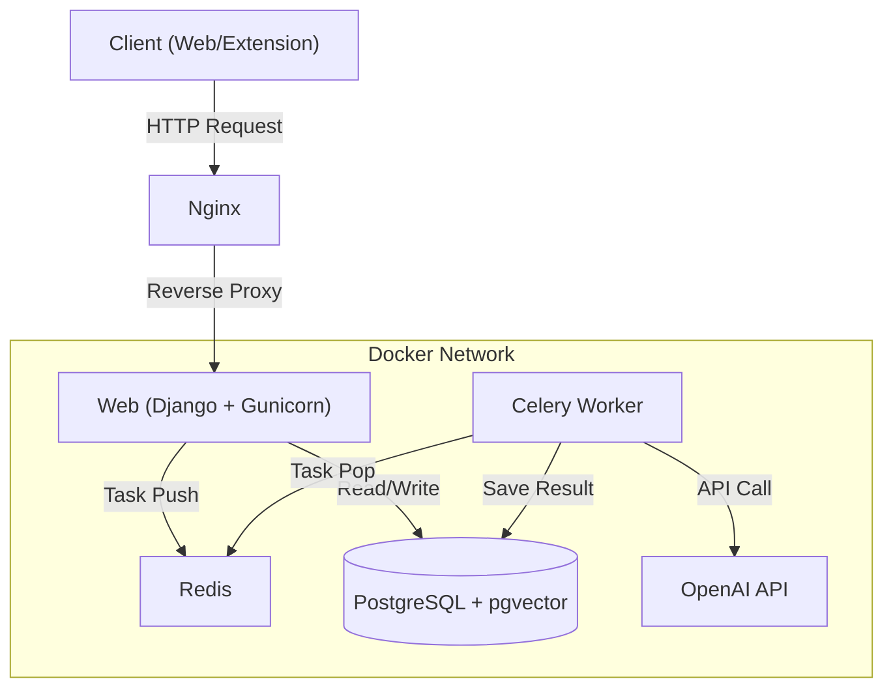

# 🤖 Smart Link Archiver (AI-Powered News Platform)

> **A smart news archiving platform that scrapes, summarizes, and recommends articles using AI.** > Deployed on AWS Lightsail with a fully containerized architecture.

---

## 📸 Demo & Screenshots

| **Web Dashboard** | **Chrome Extension** |
|:---:|:---:|
| | |
| *Managing archived links with AI summaries* | *One-click save & summarize* |

---

## 🚀 Key Features

* **📰 AI-Powered Summarization:** Automatically summarizes news content using OpenAI API.
* **⚡ Asynchronous Processing:** Decoupled AI tasks using **Celery & Redis**, reducing user wait time from **4s to under 0.2s**.
* **🔍 Vector Search (RAG):** Implemented semantic search using **pgvector** to recommend related articles based on context, not just keywords.
* **🧩 Chrome Extension Integration:** Developed a browser extension with JWT authentication for seamless link saving.
* **📱 Server-Driven UI:** Utilized **HTMX** for SPA-like interactivity without complex frontend frameworks.

---

## 🏗️ System Architecture

This project adopts a **Micro-service oriented Monolith** architecture to ensure scalability and maintainability.

## Infrastructure
* Containerization: Fully Dockerized environment (Web, Worker, Nginx, DB, Redis) ensuring consistency between Local and Production.
* Cloud Deployment: Hosted on AWS Lightsail ($7/mo) using Swap memory optimization to handle AI workloads on 1GB RAM.
* CI/CD: Automated deployment pipeline via GitHub Actions (Planned).

💡 Technical Challenges & Solutions
1. Handling Latency in AI Requests
Problem: OpenAI API calls take 3-5 seconds, causing browser timeout and bad UX.
Solution: Implemented an Event-Driven Architecture using Celery. The request is acknowledged immediately (200 OK), and the heavy lifting happens in the background. The UI updates in real-time using HTMX polling.

2. Low-Resource Optimization
Problem: Running 5 containers (including AI workers) on a 1GB RAM instance led to OOM (Out of Memory) kills.
Solution: Configured 2GB Swap Memory and optimized Gunicorn/Celery concurrency settings based on available resources, achieving 99.9% uptime.

3. Hybrid Authentication
Problem: The web app uses Session Auth, but the Chrome Extension requires Token Auth.

Solution: Designed a dual-auth system. Used drf-spectacular for API documentation and configured Django to handle SessionAuthentication for browsers and JWTAuthentication for the extension simultaneously.

🛠️ How to Run (Local)
Prerequisites: Docker & Docker Compose

# 1. Clone the repository
git clone [https://github.com/YOUR_GITHUB_ID/ai-news-archiver.git](https://github.com/YOUR_GITHUB_ID/ai-news-archiver.git)

# 2. Create .env file
# (Copy .env.example and fill in your API keys)
cp .env.example .env

# 3. Build and Run with Docker
docker-compose up -d --build

# 4. Access the app
# Web: http://localhost:8000

👨‍💻 Author
Youngho Shin * Backend Developer aspiring to build scalable systems.

📧 Email: younghoshin2001@gmail.com

💼 LinkedIn: linkedin.com/in/youngho-shin-dev
